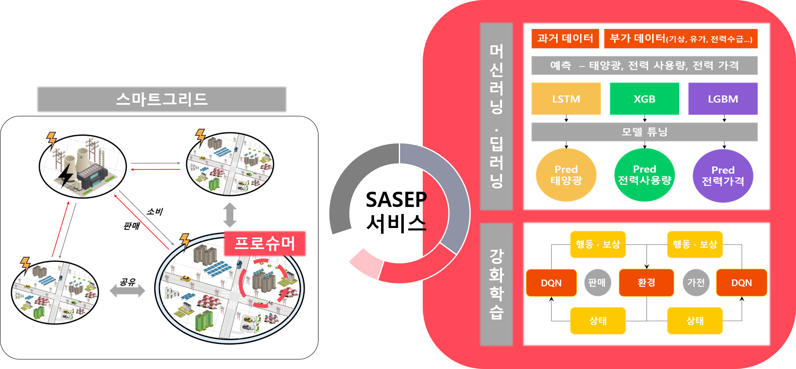
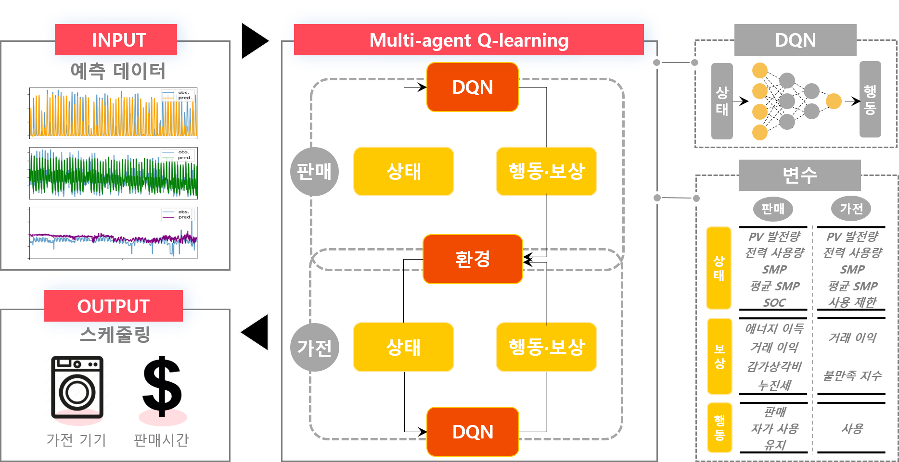
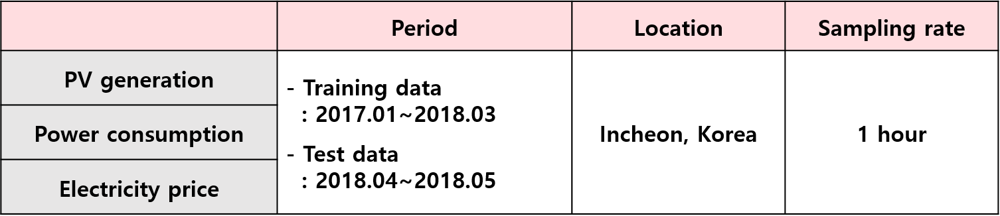
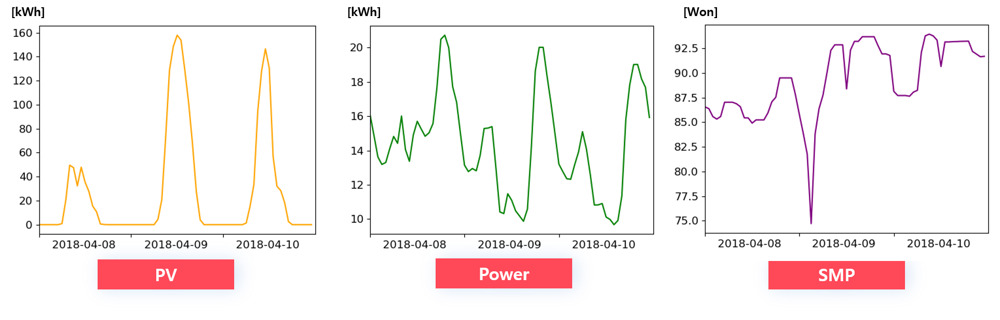
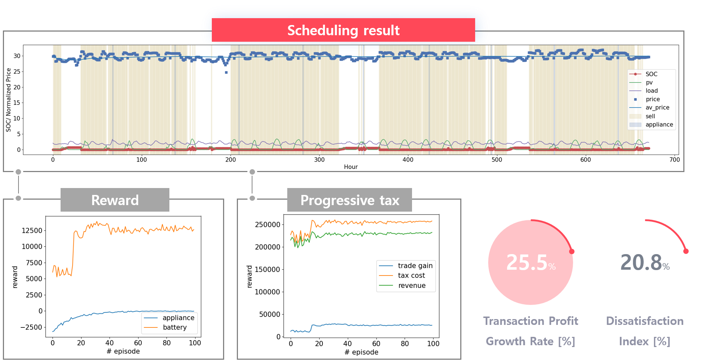
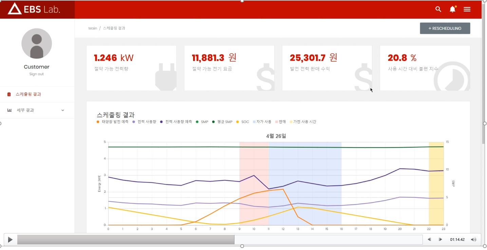
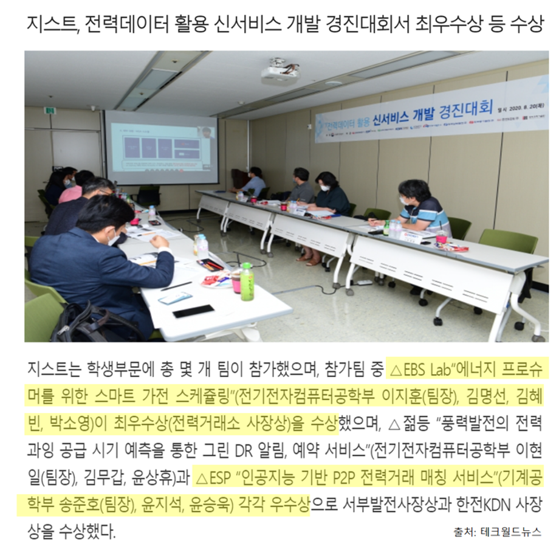

Smart appliance scheduling service for energy prosumer
=======================================
### 2020 전력데이터 신서비스 개발 경진대회
homepage: [link](https://home.kepco.co.kr/kepco/NS/main/main.do)

### __Context__
* [Introduction](#introduction)
* [Methodology](#methodology)
* [Result](#result)
* [Usage](#usage)
* [GUI dashboard](#gui-dashboard)
* [Prize](#prize)

### __Structure__
The structure of the project is as follows.
```setup
.
└── main.py
└── test.py
└── plot-figs.py
└── utils.py
└── data
└── models
└── results
└── smp-modules
    └── smp-pred-ar.py
    └── smp-pred-lgb.py
    └── smp-pred-lstm.py
    └── smp-pred-util.py
└── ppt
```
* main.py: main file
* test.py: test file with pre-trained model in main file
* plot-figs.py: for visualization
* utils.py: utilities
* data: train and test data used in main and test file
* models: pre-trained models which is result of main file
* results: result of training
* smp-modules: smp prediction module
    - ar, lgb, lstm model
* ppt: presentation file

Introduction
=======================

### Background
* In developed countries such as Germany and the U.S., the number of prosumers who directly develop and sell energy is increasing
* prosumer: producer + consumer (consume and produce energy at the same time)
* Government plans to introduce real-time power transaction markets in the next 5 years

### Overview

* Propose services to enable efficient power transactions and sharing
* Proposed service: __Smart Appliance Scheduling for Energy Prosumer (SASEP)__
* Energy scheduling service which consider progressive tax
* Services that provide scheduling with the goal of maximizing user expectations by optimizing when power is sold and when home appliances are used  

Methodology
=======================
* Input: actual value (training), predicted value (test)
* Output: monthly scheduling results for the hours of use, power sales, and amount of sales
* Model: Multi-agent Q-learning
* Sales and two appliances share the environment, taking action and returning rewards respectively  



First, the appliance agent is inputted and acted upon, as shown in the lower right variable.
Here, behavior is whether the appliance is used or not, and the value of 0 or 1 is printed.
The trade profit and dissatisfaction index are used as compensation for the behavior.
The transaction profit portion, when compared to the average price of electricity at that time, limits its use in expensive times by giving a reward for cheap and a penalty for expensive.
The Non-Compliance Index section imposes a penalty if the hours of use recommended for scheduling differ significantly from the user's preferred hours of use.
In this way, the behavior of the appliance changes the power usage, reflecting this, the status information is updated and entered in the sales agent.
The sales agent first charges the PV generation to the battery and then checks the state of charge to determine how much energy it sells, how much energy it uses, or whether it uses itself or not.
The compensation is the same as on the right.
In terms of battery, rewards and penalty are charged considering profit, loss, and depreciation costs.
In this way, we will proceed with the learning in a way that calculates the reward sum of the two agents and takes the maximum reward.

Dataset
======================
Dataset is provided from Korea Electric Power Corporation (KEPCO)   
The description is as follows:  


Sample is like the belows:  


Result
=======================
The following is the results of a month's real-time scheduling


* The graph at the top shows sales agent and appliance status and action information on an hourly basis
* The bottom is a graph of the reward sum and transaction profit according to the episode
* As the episode increases, you can see that the rewards increase, and so does the transaction profit
* In addition, the dissatisfaction index for washing machine use was about 20%, which shows a difference of 5 hours compared to the preferred time of use

Usage
==================
### Requirements 
To install requirements:
```setup
pip install -r requirements.txt
```
### Training and Evaluation
* Training
```train and eval
python main.py
```
* Evaluate (test)
    * You can evaluate the result with the pre-trained model
```
python test.py
```

GUI dashboard
=======================


Implement dashboards to provide scheduling status to consumers

Prize
=======================


Got the grand prize   

Contact
==================
If there is something wrong or you have any questions, send me an e-mail or make an issue.  
[](mailto:pond9816@gmail.com)